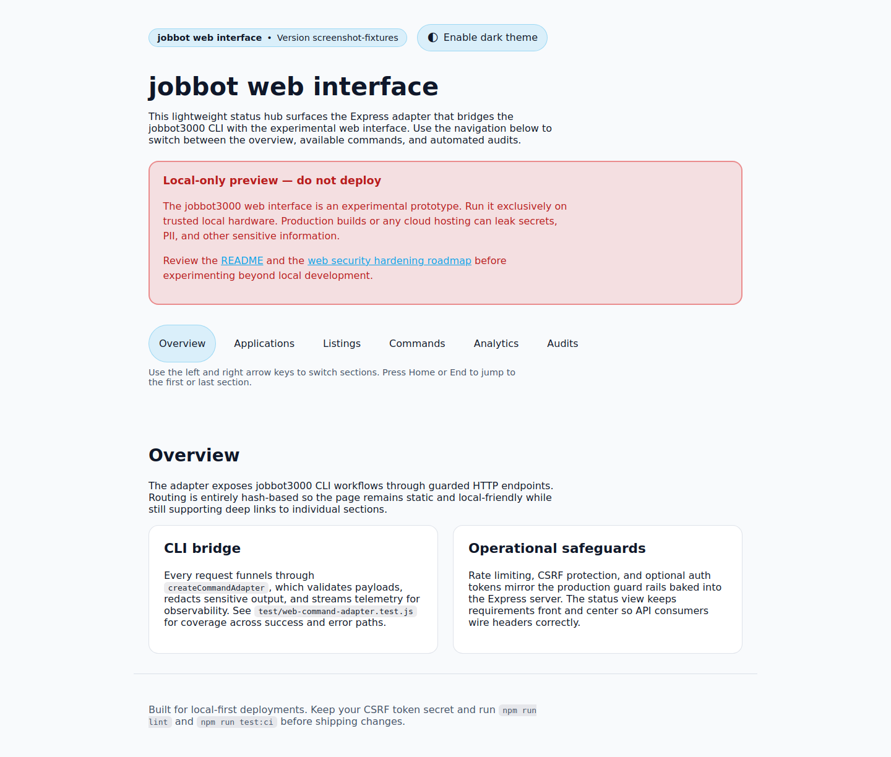
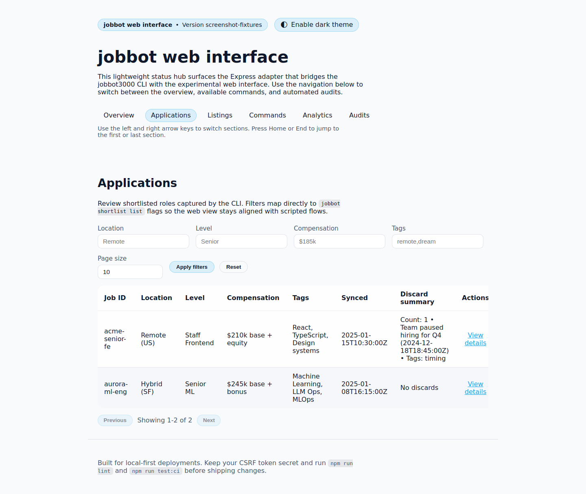
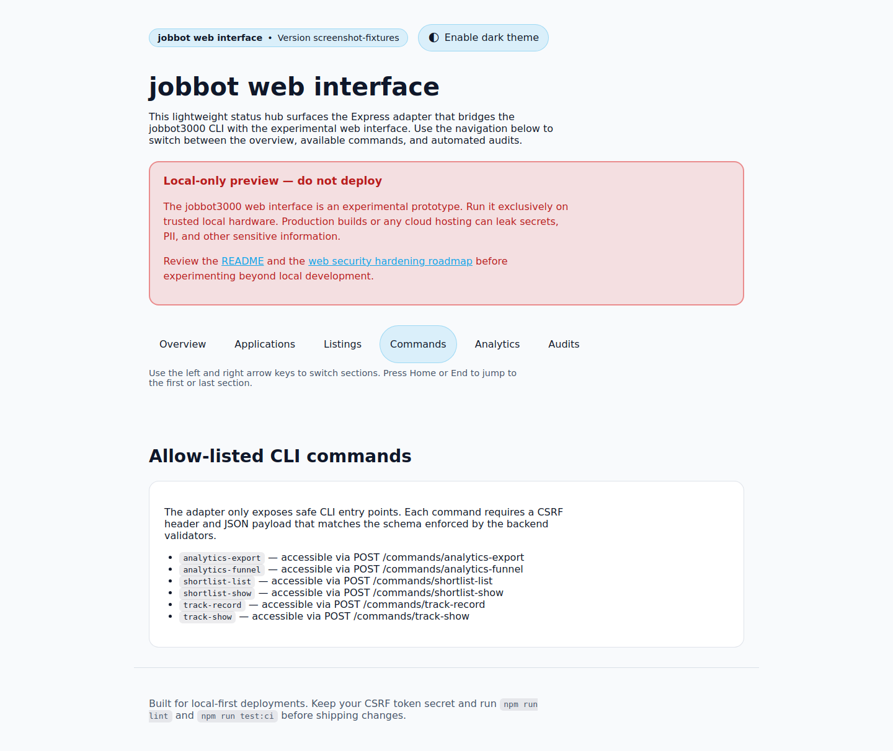
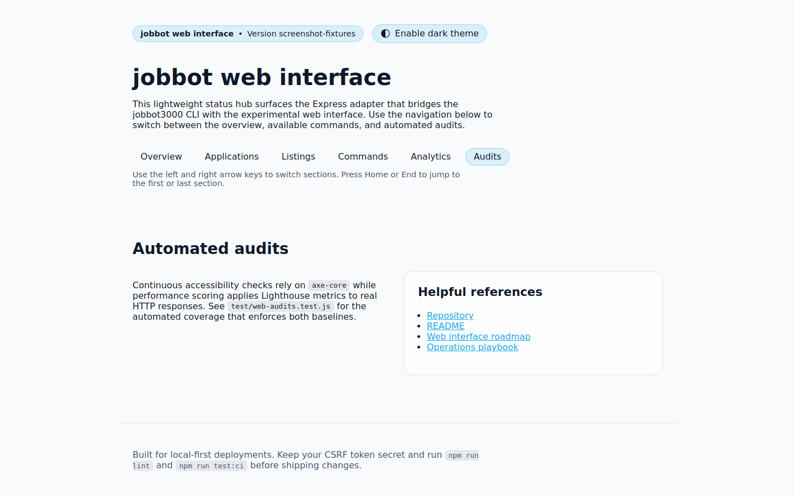

# 🎯 jobbot3000

[](https://github.com/futuroptimist/jobbot3000/actions/workflows/ci.yml)
[](https://github.com/futuroptimist/jobbot3000/actions/workflows/codeql.yml)
[](https://github.com/futuroptimist/jobbot3000/actions/workflows/web-screenshots.yml)
[](#license)

**jobbot3000** is a self-hosted, open-source job search copilot.

## Quickstart

Requires Node.js 20+.

```bash
npm install
npm run dev
# Open http://127.0.0.1:3100
```

That's it! The web server will start with all backend functionality enabled.

For detailed setup, CLI usage, and environment options, see [docs/getting-started.md](docs/getting-started.md).

## HTTP client example

Use the built-in HTTP client helper when integrating with external services:

```js
import { createHttpClient } from './src/services/http.js';

const client = createHttpClient({
  baseUrl: 'https://api.example.com',
});

const response = await client.get('/status');
console.log(await response.json());
```

Run the snippet with `node example.js` after saving it to a file in the project root.

## Documentation

- [DESIGN.md](DESIGN.md) – architecture details and roadmap
- [SECURITY.md](SECURITY.md) – security guidelines
- [docs/prompt-docs-summary.md](docs/prompt-docs-summary.md) – prompt reference index
- [docs/user-journeys.md](docs/user-journeys.md) – primary user journeys and flows
- [GitHub Actions: web-screenshots.yml](https://github.com/futuroptimist/jobbot3000/actions/workflows/web-screenshots.yml) – captures the latest UI flows for regressions

## UI screenshots







## License

This project is licensed under the terms of the [MIT License](LICENSE).
