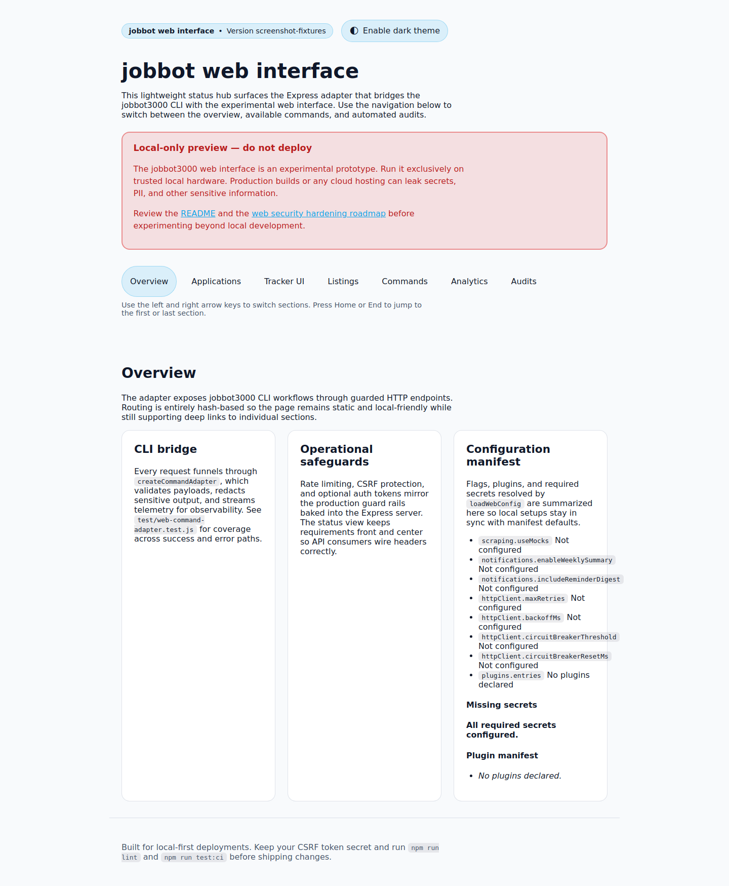
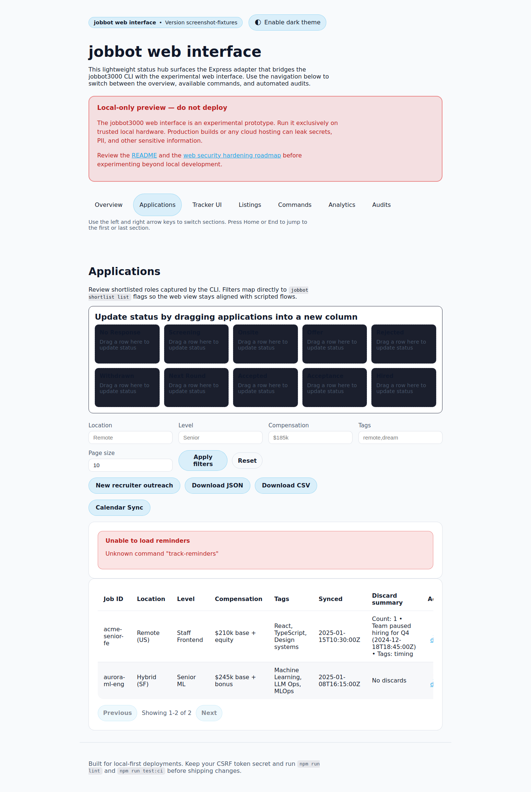
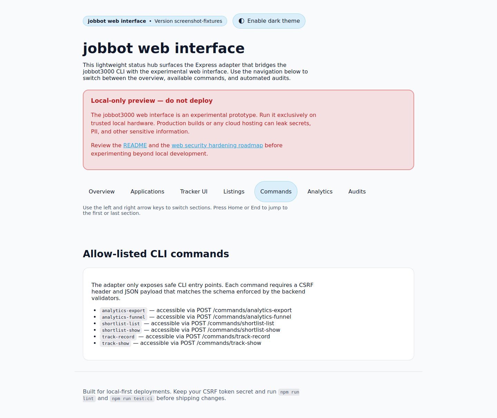
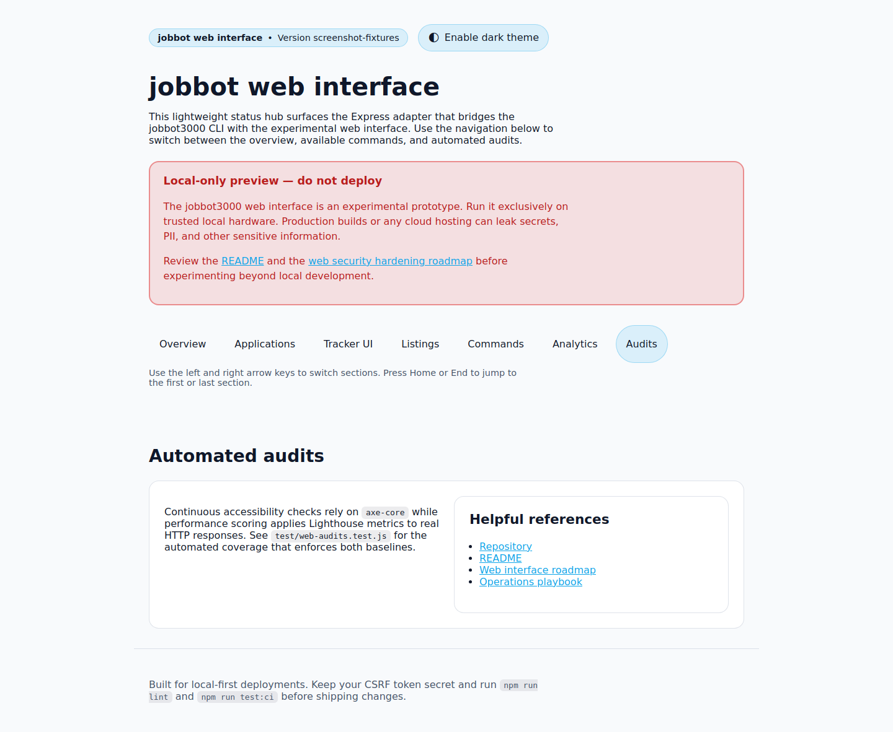
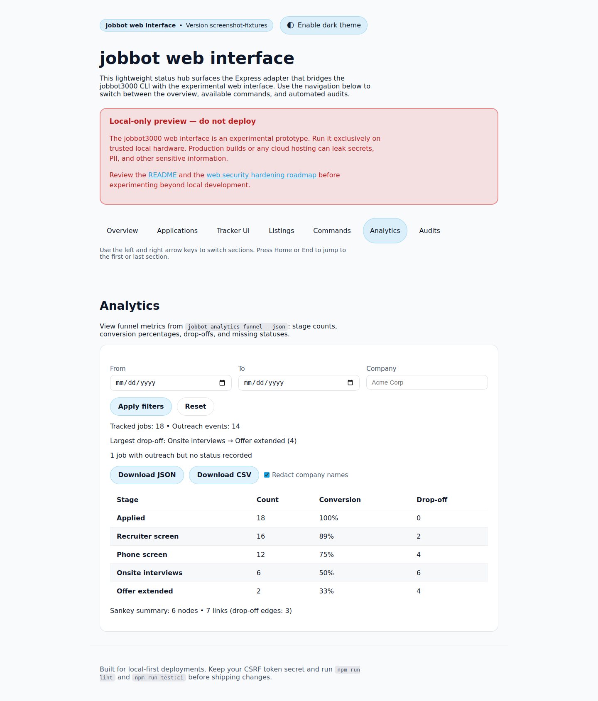

# 🎯 jobbot3000

[](https://github.com/futuroptimist/jobbot3000/actions/workflows/ci.yml)
[](https://github.com/futuroptimist/jobbot3000/actions/workflows/codeql.yml)
[](https://github.com/futuroptimist/jobbot3000/actions/workflows/web-screenshots.yml)
[](#license)

**jobbot3000** is a self-hosted, open-source job search copilot.

The production web tracker is browser-first: private application tracking data lives in user-owned IndexedDB, while the deployed server/container serves static assets and health endpoints. See [docs/browser-first-architecture.md](docs/browser-first-architecture.md) for the data contract and [docs/privacy-and-security.md](docs/privacy-and-security.md) for operating boundaries.

> [!WARNING]
> The static IndexedDB tracker can be deployed as a browser-only app because private tracker data is not posted back to the server. The CLI/development server mode remains sensitive: command endpoints, provider-token management, local files, and SQLite-backed workflows are intended for trusted local or explicitly secured environments only.

## Quickstart

Requires Node.js 20+.

```bash
npm install
npm run dev
# Open http://127.0.0.1:3100
```

For production static tracker builds, run `npm run build` and serve `dist/` with `npm run start:static`; `/healthz` and `/livez` are available for container probes.

Production readiness docs:

- [Production readiness](docs/production-readiness.md)
- [Spreadsheet migration](docs/import-current-spreadsheet.md)
- [Backup and restore](docs/backup-restore-guide.md)
- [Static tracker staging verification](docs/staging-tracker-verification.md)
- [GHCR image release](docs/release-ghcr.md)
- [Helm chart release](docs/release-helm.md)

### Deploy with Sugarkube

Sugarkube owns the cluster-specific runbook and values. At a high level: publish
`ghcr.io/futuroptimist/jobbot3000` with an immutable `main-SHORTSHA` image tag,
publish `oci://ghcr.io/futuroptimist/charts/jobbot3000` only when chart content
changes, deploy staging with that immutable tag, verify `/`, `/healthz`, and
`/livez`, import a backup through the browser UI, export JSON/NDJSON from the
browser UI, and then promote production with the same immutable tag. Do not use
mutable tags such as `latest` for production and do not place real hostnames,
secrets, or tracker data in this repo. See the Sugarkube jobbot3000 runbook in
the `futuroptimist/sugarkube` repo for cluster steps.

The development web server starts with backend functionality enabled.
Use `npm run web:server -- --disable-native-cli` if you want to explore the
mock-only UI without spawning CLI subprocesses.

For detailed setup, CLI usage, and environment options, see [docs/getting-started.md](docs/getting-started.md).

## Onboarding checklist

New contributors can ramp up quickly by following this short checklist:

1. Review the architecture map in [docs/architecture.md](docs/architecture.md) to understand how the
   CLI, web adapter, and data stores fit together.
2. Skim the [Configuration Cookbook](docs/configuration-cookbook.md) for required environment
   variables and managed secret options before running commands.
3. Run `npm ci`, `npm run lint`, and `npm run test:ci` to ensure your environment matches CI before
   making changes.
4. Browse the regression suites in [`test/`](test) to see how critical flows are covered and where to
   add new scenarios.

### Recruiter reach-outs

1. Save the raw email to disk, then ingest it: `node bin/ingest-recruiter.ts --source emails/recruiter.txt`.
2. Open **Opportunities ▸ New → Recruiter outreach** to paste additional emails directly from the UI.
3. Confirm the parsed phone screen details (`Phone screen: Thu Oct 23, 2:00 PM PT`) and advance the
   lifecycle when the call finishes. The modal previews the sanitized outreach summary and immediately
   refreshes the applications list so the new event is visible without a page reload.

Automated tests cover both halves of the flow: `test/web-command-adapter.test.js` validates the
`recruiter-ingest` command sanitizes data and closes repositories, while
`test/web-server.test.js` exercises the web modal end-to-end, including the shortlist refresh and
success preview.

Ingestion is idempotent: running the CLI twice for the same email will update the existing
opportunity instead of creating duplicates.

## API Setup (Optional)

By default, jobbot3000 runs with mock data enabled, so you can explore the interface without API tokens. When you're ready to connect to real job boards, follow these steps:

### 1. Create your environment file

```bash
cp .env.example .env
```

### 2. Get your API tokens

Visit each provider's developer portal to generate API tokens:

| Provider            | Documentation                                                                      | Where to get it                                                              |
| ------------------- | ---------------------------------------------------------------------------------- | ---------------------------------------------------------------------------- |
| **Greenhouse**      | [API Documentation](https://developers.greenhouse.io/harvest.html#authentication)  | Your Greenhouse account → Configure → Dev Center → API Credential Management |
| **Lever**           | [API Documentation](https://hire.lever.co/developer/documentation#authentication)  | Settings → Integrations → API                                                |
| **SmartRecruiters** | [API Documentation](https://developers.smartrecruiters.com/docs/getting-started)   | Settings → API & Integrations → API Credentials                              |
| **Workable**        | [API Documentation](https://workable.readme.io/reference/generate-an-access-token) | Settings → Integrations → API                                                |

### 3. Add tokens to your `.env` file

```bash
# Required for live job scraping
JOBBOT_GREENHOUSE_TOKEN=your_greenhouse_token_here
JOBBOT_LEVER_API_TOKEN=your_lever_token_here
JOBBOT_SMARTRECRUITERS_TOKEN=your_smartrecruiters_token_here
JOBBOT_WORKABLE_TOKEN=your_workable_token_here

# Disable mocks to use real APIs
JOBBOT_FEATURE_SCRAPING_MOCKS=false
```

### Update tokens from the web app

Prefer to manage secrets in the UI? Open the **Listings** tab and use the **Provider tokens** panel
to paste each API token. The server writes changes back to your local `.env` file, so manual edits and
web updates stay in sync.

### 4. Restart the server

```bash
npm run dev
```

Your server will now connect to live job boards! 🚀 The development server and CLI automatically
load your `.env` file on startup, so no additional export commands are required.

> **Note:** The `.env` file is gitignored and will never be committed. Keep your tokens secure and never share them publicly.

For advanced configuration options, see [docs/configuration-cookbook.md](docs/configuration-cookbook.md).

### Configure inference & privacy defaults

Use the `settings` command to select your preferred inference provider and align privacy
defaults:

```bash
# Switch to vLLM and choose a model preset
jobbot settings configure --model-provider vllm --model gpt-4o-mini

# Enable analytics redaction and keep interview transcripts stored locally
jobbot settings configure --privacy-redact-analytics on --privacy-store-transcripts on

# Inspect the current configuration
jobbot settings show --json
```

Analytics exports automatically honor the redaction toggle unless you override it with
`--no-redact`, and disabling transcript storage prevents interview sessions from persisting
verbatim transcripts or transcript-derived heuristics on disk.

## HTTP client example

Use the built-in HTTP client helper when integrating with external services:

```js
import { createHttpClient } from "./src/services/http.js";

const client = createHttpClient({
  baseUrl: "https://api.example.com",
});

const response = await client.get("/status");
console.log(await response.json());
```

Run the snippet with `node example.js` after saving it to a file in the project root.

## Release and deployment

Production deployments use the static, browser-local web build. The container serves static assets and `/healthz` and `/livez`; it does not own private tracker data, Secrets, or application data volumes.

- [docs/release-ghcr.md](docs/release-ghcr.md) explains the GHCR image workflow and immutable image tags such as `ghcr.io/futuroptimist/jobbot3000:main-<short-sha>`.
- [docs/release-helm.md](docs/release-helm.md) explains the app-owned Helm chart, OCI publishing workflow, and Sugarkube chart pin for `oci://ghcr.io/futuroptimist/charts/jobbot3000`.
- [charts/jobbot3000/ci](charts/jobbot3000/ci) contains placeholder dev, staging, and production values examples for Sugarkube-owned environment configuration.

Image tags and chart versions are intentionally separate: bump the image tag for a new static app build, and bump `charts/jobbot3000/Chart.yaml` `version` for Kubernetes packaging or default-value changes.

## Documentation

- [DESIGN.md](DESIGN.md) – architecture details and roadmap
- [SECURITY.md](SECURITY.md) – security guidelines
- [docs/prompt-docs-summary.md](docs/prompt-docs-summary.md) – prompt reference index
- [docs/user-journeys.md](docs/user-journeys.md) – primary user journeys and flows
- [docs/browser-first-architecture.md](docs/browser-first-architecture.md) – planned IndexedDB-first production web architecture and browser data contract
- [docs/design/application-lifecycle-diagram.md](docs/design/application-lifecycle-diagram.md) – normative design contract for the browser Application Lifecycle Diagram
- [docs/privacy-and-security.md](docs/privacy-and-security.md) – browser-only production privacy model, backups, clearing data, quota caveats, and static security headers
- [docs/indexeddb-persistence.md](docs/indexeddb-persistence.md) – browser IndexedDB persistence, backup/restore, and quota caveats
- [docs/spreadsheet-replacement.md](docs/spreadsheet-replacement.md) – CSV/JSON/NDJSON import-export workflow for replacing the current spreadsheet
- [docs/backup-restore-guide.md](docs/backup-restore-guide.md) – backup, restore, and verification
  steps
- [docs/web-ux-guidelines.md](docs/web-ux-guidelines.md) – layout, typography, and interaction guardrails
- [GitHub Actions: web-screenshots.yml](https://github.com/futuroptimist/jobbot3000/actions/workflows/web-screenshots.yml) – captures the latest UI flows for regressions

### Durable data export/import

The current CLI/recruiter-ingest preview stores recruiter outreach, contacts, and lifecycle events in `data/opportunities.db` (SQLite via Drizzle ORM). The planned production web tracker will instead store private application data in browser-owned IndexedDB and use explicit JSON/NDJSON/CSV backup files; see [docs/browser-first-architecture.md](docs/browser-first-architecture.md). Use the bundled scripts to back up or restore the current CLI opportunity records:

```bash
# Export every table as newline-delimited JSON
node scripts/export-data.js > backups/opportunities.ndjson

# Validate and import (dry-run)
node scripts/import-data.js --source backups/opportunities.ndjson --dry-run

# Apply the import
node scripts/import-data.js --source backups/opportunities.ndjson
```

Both scripts respect `JOBBOT_DATA_DIR` so you can point to alternate data directories during tests or
migrations.

### Analytics compensation summary

Use the CLI to review parsed compensation ranges stored in the shortlist. The text output highlights
currency breakdowns, ranges, and median midpoints, while `--json` emits the structured snapshot for
automation:

```bash
jobbot analytics compensation
jobbot analytics compensation --json
```

### Role/location heatmap

Surface which levels and locations dominate your shortlist so you can rebalance outreach. The report
outputs a pivoted grid for quick scanning or JSON for downstream automation:

```bash
jobbot analytics heatmap
jobbot analytics heatmap --json
```

## UI screenshots







## License

This project is licensed under the terms of the [MIT License](LICENSE).
