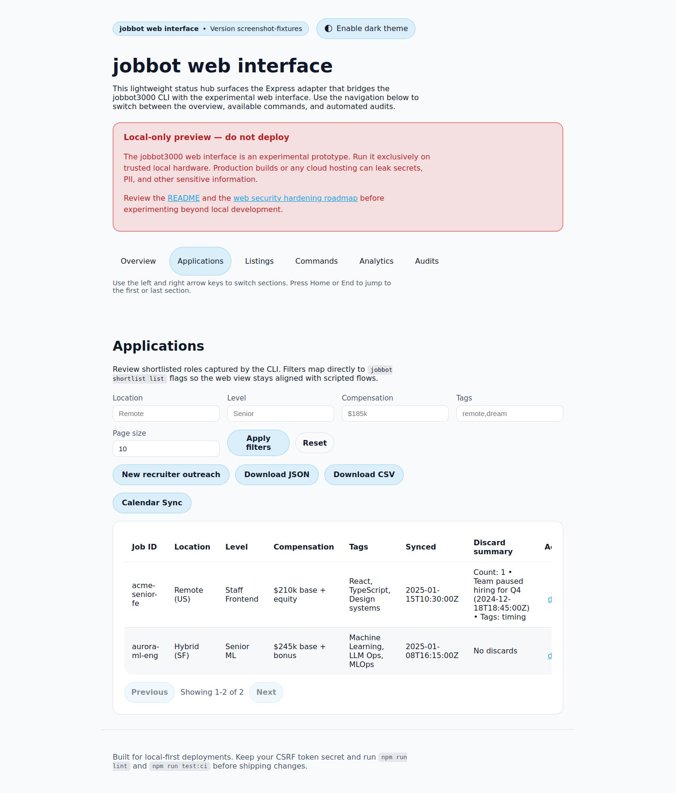

# 🎯 jobbot3000

[](https://github.com/futuroptimist/jobbot3000/actions/workflows/ci.yml)
[](https://github.com/futuroptimist/jobbot3000/actions/workflows/codeql.yml)
[](https://github.com/futuroptimist/jobbot3000/actions/workflows/web-screenshots.yml)
[](#license)

**jobbot3000** is a self-hosted, open-source job search copilot.

## Quickstart

Requires Node.js 20+.

```bash
npm install
npm run dev
# Open http://127.0.0.1:3100
```

That's it! The web server will start with all backend functionality enabled.

For detailed setup, CLI usage, and environment options, see [docs/getting-started.md](docs/getting-started.md).

## API Setup (Optional)

By default, jobbot3000 runs with mock data enabled, so you can explore the interface without API tokens. When you're ready to connect to real job boards, follow these steps:

### 1. Create your environment file

```bash
cp .env.example .env
```

### 2. Get your API tokens

Visit each provider's developer portal to generate API tokens:

| Provider | Documentation | Where to get it |
|----------|--------------|-----------------|
| **Greenhouse** | [API Documentation](https://developers.greenhouse.io/harvest.html#authentication) | Your Greenhouse account → Configure → Dev Center → API Credential Management |
| **Lever** | [API Documentation](https://hire.lever.co/developer/documentation#authentication) | Settings → Integrations → API |
| **SmartRecruiters** | [API Documentation](https://developers.smartrecruiters.com/docs/getting-started) | Settings → API & Integrations → API Credentials |
| **Workable** | [API Documentation](https://workable.readme.io/reference/generate-an-access-token) | Settings → Integrations → API |

### 3. Add tokens to your `.env` file

```bash
# Required for live job scraping
JOBBOT_GREENHOUSE_TOKEN=your_greenhouse_token_here
JOBBOT_LEVER_API_TOKEN=your_lever_token_here
JOBBOT_SMARTRECRUITERS_TOKEN=your_smartrecruiters_token_here
JOBBOT_WORKABLE_TOKEN=your_workable_token_here

# Disable mocks to use real APIs
JOBBOT_FEATURE_SCRAPING_MOCKS=false
```

### 4. Restart the server

```bash
npm run dev
```

Your server will now connect to live job boards! 🚀 The development server and CLI automatically
load your `.env` file on startup, so no additional export commands are required.

> **Note:** The `.env` file is gitignored and will never be committed. Keep your tokens secure and never share them publicly.

For advanced configuration options, see [docs/configuration-cookbook.md](docs/configuration-cookbook.md).

## HTTP client example

Use the built-in HTTP client helper when integrating with external services:

```js
import { createHttpClient } from './src/services/http.js';

const client = createHttpClient({
  baseUrl: 'https://api.example.com',
});

const response = await client.get('/status');
console.log(await response.json());
```

Run the snippet with `node example.js` after saving it to a file in the project root.

## Documentation

- [DESIGN.md](DESIGN.md) – architecture details and roadmap
- [SECURITY.md](SECURITY.md) – security guidelines
- [docs/prompt-docs-summary.md](docs/prompt-docs-summary.md) – prompt reference index
- [docs/user-journeys.md](docs/user-journeys.md) – primary user journeys and flows
- [GitHub Actions: web-screenshots.yml](https://github.com/futuroptimist/jobbot3000/actions/workflows/web-screenshots.yml) – captures the latest UI flows for regressions

## UI screenshots





## License

This project is licensed under the terms of the [MIT License](LICENSE).
