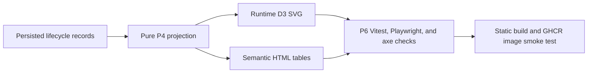

# Application Lifecycle Diagram P6 validation

**Status:** P6 hardening implemented and validated for merge readiness. The P1 design contract in `application-lifecycle-diagram.md` remains normative; this document records the release validation scope and the tests that protect it.

## Scope and completion

P6 validates the runtime SVG Diagram, equivalent semantic HTML tables, timeline navigation, accessibility, responsive behavior, security/privacy, large-data DOM bounds, static build behavior, container smoke contract, CI wiring, and binary-file policy. The feature remains browser-only with IndexedDB application data, locally bundled `d3-sankey`, no CDN, no telemetry, no backend persistence, and no raster diagram deliverable.

## Requirements-to-tests traceability

| P1 UI/accessibility requirement                                                                                                   | P6 validation                                                                                                           |
| --------------------------------------------------------------------------------------------------------------------------------- | ----------------------------------------------------------------------------------------------------------------------- |
| Diagram tab appears immediately after Dashboard and opens at Current                                                              | `test/playwright/lifecycle-diagram.spec.js` empty and seeded journeys                                                   |
| Runtime SVG is bounded to fixed origin, milestone, and endpoint taxonomy                                                          | `test/web-tracker-lifecycle-diagram-performance.test.js` node-count and no-company assertions                           |
| Equivalent semantic origin, milestone, endpoint, flow, and event tables                                                           | `test/web-tracker-lifecycle-diagram.test.js` and `test/playwright/lifecycle-diagram.spec.js` table/SVG agreement checks |
| Historical timeline supports Unknown date, date-only buckets, exact instants, simultaneous events, inclusive cutoffs, and Current | Projection tests plus focused Diagram Vitest and Playwright historical navigation                                       |
| Included/total application count, warning summary, simultaneous disclosure, and Newer activity available messaging                | Focused Diagram Vitest and Playwright navigation/live-update journey                                                    |
| Keyboard access through semantic buttons, not raw SVG paths                                                                       | Semantic table selection tests and accessibility assertions                                                             |
| Pointer/touch SVG selection with transparent nonvisual hit targets                                                                | Component tests for `aria-hidden` hit geometry and Playwright mouse/touch journeys                                      |
| Selection is expressed in text/state as well as color                                                                             | `aria-pressed` checks and details-panel text assertions                                                                 |
| Canonical timestamps use `<time datetime>`; unknown dates are off-scale text                                                      | Component and E2E timestamp assertions                                                                                  |
| Resize rerenders cleanly and destroy removes observers                                                                            | Component resize/debounce/destroy tests                                                                                 |
| Reduced-motion mode does not leave active Diagram animation                                                                       | Component and Playwright reduced-motion assertions                                                                      |
| No editing, autoplay, filters, or predictive scoring from Diagram                                                                 | Playwright read-only behavior assertions                                                                                |

## Viewport coverage

| Viewport             | Coverage                                                                                             |
| -------------------- | ---------------------------------------------------------------------------------------------------- |
| Desktop 1440×900     | Playwright seeded Current, historical, selection, accessibility, and geometry checks                 |
| Touch mobile 375×812 | Playwright mobile accessibility, scroll-owner, touch selection, and no page horizontal-scroll checks |

## Accessibility checks

Playwright injects the local `axe-core` package into `[data-view="diagram"]` for empty, seeded Current, historical, selected-details, and mobile states. Zero axe violations are required. Direct assertions cover heading/navigation names, `aria-current`, SVG `role="img"` with `<title>` and `<desc>`, named range and scroll region, table captions and header scopes, polite live region behavior, focus order, visible `:focus-visible`, non-color-only selection text/state, 44×44 enabled visible controls, and reduced-motion behavior.

## Security and privacy checks

Hostile synthetic strings include `<script>`, ``, SVG markup, quotes, `javascript:` URLs, and event-handler attributes. Tests assert those strings remain inert text; no user-created `script`, `foreignObject`, unsafe anchor, handler attribute, unsafe URL, or user-controlled path markup appears; Diagram activity makes no POST/PUT/PATCH/DELETE or cross-origin request; application data is not written to URL, cookies, logs, or telemetry; `d3-sankey` is supplied by the local `/assets/tracker.js`; and static CSP keeps `default-src 'self'`, `script-src 'self'`, and `connect-src 'self'`.

## Large-data and DOM-clutter limits

The performance guard renders a deterministic bundle of 1,000 applications with eight effective events each. After one warm-up render, measured render must complete within 5,000 ms on single-worker Linux CI. The DOM remains bounded: at most 21 aggregate SVG nodes, no application/company SVG nodes, 50 event rows per page, and 50 affected application IDs per page. Pagination preserves deterministic P4 ordering and makes all records reachable.

## Static build and container checks

Static smoke coverage opens `/tracker`, exercises Diagram rendering, historical scrub, selection, local SVG, equivalent tables, no external runtime request, `/`, `/healthz`, and `/livez`. Container readiness is validated by the existing Node 20 multistage Dockerfile, non-root runtime, `.github/workflows/ci-image.yml`, `docker build`, and `npm run smoke:container -- jobbot3000:p6` when Docker is available.

## Verification commands and results

The PR body records the exact local command outcomes for `npm ci`, formatting, lint, typecheck, focused Vitest, Playwright, full CI tests, build, Docker/container smoke when available, secret scan, diff check, and binary audit.

## Binary-file policy

No repository PNG, APNG, JPEG, GIF, WebP, AVIF, BMP, ICO, TIFF, PDF, video, archive, font binary, Playwright golden image, screenshot fixture, base64 payload, data URI, or rendered Mermaid output may be added or modified by P6. Visual-review PNGs are generated only by the dedicated GitHub Actions workflow under `${RUNNER_TEMP}/jobbot3000-diagram-visual-review` and uploaded as a short-lived artifact.

## Text-native validation flow

| Relationship                                                                    | Explanation                                                                                         |
| ------------------------------------------------------------------------------- | --------------------------------------------------------------------------------------------------- |
| Persisted lifecycle records → Pure P4 projection                                | IndexedDB v2 applications and lifecycle events are replayed by the deterministic projection engine. |
| Pure P4 projection → Runtime D3 SVG                                             | The Diagram clones projection data for layout so P4 output is not mutated.                          |
| Pure P4 projection → Semantic HTML tables                                       | The same aggregate projection drives accessible tables.                                             |
| Runtime D3 SVG and Semantic HTML tables → P6 Vitest, Playwright, and axe checks | Functional, responsive, accessibility, and security assertions verify both representations.         |
| P6 checks → Static build and GHCR image smoke test                              | Passing browser checks are carried into static build and container smoke validation.                |
