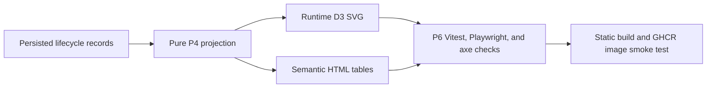

# Application Lifecycle Diagram P6 validation

**Status:** P6 hardening implemented and validated for production readiness.

## Scope and completion

P6 validates the P1 design contract through DOM, semantic table, SVG geometry, accessibility, security/privacy, performance, static build, and container checks. IndexedDB remains the only application-data store; the Diagram has no backend persistence, cookies, telemetry, analytics, CDN, or runtime network dependency.

## Requirements-to-tests traceability

| P1 UI/accessibility requirement                                     | P6 validation                                                                          |
| ------------------------------------------------------------------- | -------------------------------------------------------------------------------------- |
| Diagram tab appears immediately after Dashboard                     | `test/playwright/lifecycle-diagram.spec.js` empty-state journey                        |
| Current and historical lifecycle snapshots                          | Vitest lifecycle Diagram tests and Playwright historical journey                       |
| Runtime SVG plus equivalent semantic tables                         | Vitest semantic-selection tests; Playwright seeded current checks                      |
| Fixed origin, milestone, and endpoint taxonomy                      | Projection tests plus fixture-backed Playwright assertions                             |
| No company/application SVG nodes                                    | Performance test asserts aggregate node cap and no synthetic IDs in SVG nodes          |
| Keyboard access via semantic controls                               | Vitest and Playwright selection journeys assert table buttons and `aria-pressed`       |
| Text/state selection, not color alone                               | Details panel and pressed table controls are asserted                                  |
| Timestamp semantics and unknown dates                               | Vitest and Playwright historical checks assert `<time datetime>` and unknown-date text |
| Warning, included/total, simultaneous event, newer-activity notices | Component and E2E checks assert all notices                                            |
| Responsive and touch support                                        | Playwright runs desktop 1440×900 and touch mobile 375×812 geometry checks              |
| Reduced motion                                                      | Vitest and Playwright assert reduced-motion mode has no active Diagram animation       |
| No unbounded DOM growth                                             | Vitest performance test asserts 50-row event/application pages                         |

## Desktop and mobile viewport coverage

Desktop is validated at 1440×900. Touch mobile is validated at 375×812 with `hasTouch: true`, local chart overflow, and no page-level horizontal scrolling.

## Accessibility checks

Playwright injects local `axe-core` into `[data-view="diagram"]` for empty, seeded current, historical, selected-detail, and mobile states. Tests require zero violations and directly assert named heading/navigation, current nav state, SVG `role="img"` with `<title>`/`<desc>`, named range and scroll region, table captions and scoped headers, polite live region, focus visibility, 44×44 enabled controls, and reduced-motion behavior.

## Security/privacy checks

Hostile synthetic strings such as `<script>`, ``, SVG markup, quotes, `javascript:` URLs, and event-handler attributes are displayed as inert text. Tests assert no user-created script, `foreignObject`, unsafe links, event-handler attributes, unsafe URLs, cross-origin requests, mutating requests, cookies, telemetry, or application data in URLs.

## Large-data and DOM-clutter limits

The large deterministic Vitest bundle contains 1,000 applications with eight effective events each. After a warm-up render, the measured render must complete within 5,000 ms. Initial event rows and affected-application IDs are capped at 50 per page while every record remains reachable through pagination.

## Static build and container checks

Static smoke coverage opens `/tracker`, exercises deterministic Diagram data, verifies local `/assets/tracker.js`, confirms no CDN reference, and checks `/`, `/tracker`, `/healthz`, and `/livez`. The GHCR image workflow remains the authoritative Node 20 multistage, non-root runtime build and smoke test for pull requests.

## Binary-file policy

No repository PNG, APNG, JPEG, GIF, WebP, AVIF, BMP, ICO, TIFF, PDF, video, archive, font binary, Playwright golden image, or other binary artifact may be created, modified, staged, or committed. Visual-review screenshots are generated only in GitHub Actions runner temp storage and uploaded as short-lived artifacts.

## Validation flow

| From                                    | To                                     | Meaning                                                                                  |
| --------------------------------------- | -------------------------------------- | ---------------------------------------------------------------------------------------- |
| Persisted lifecycle records             | Pure P4 projection                     | IndexedDB records are replayed by deterministic projection code.                         |
| Pure P4 projection                      | Runtime D3 SVG                         | The projection supplies aggregate fixed-taxonomy nodes and flows.                        |
| Pure P4 projection                      | Semantic HTML tables                   | The same projection supplies keyboard-accessible equivalent tables.                      |
| Runtime D3 SVG and Semantic HTML tables | P6 Vitest, Playwright, and axe checks  | Functional, accessibility, responsive, and security assertions validate both renderings. |
| P6 checks                               | Static build and GHCR image smoke test | The validated Diagram is exercised in static build and container workflows.              |

## Exact verification commands and results

Results are recorded in the PR body for the exact local run, including `npm ci`, format, lint, typecheck, focused Vitest, Playwright, full CI test, build, Docker/container when available, secret scan, and binary audit.
