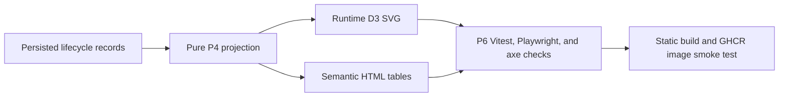

# Application Lifecycle Diagram P6 validation

**Status:** P6 hardening implemented for production readiness. This document is text-only and does not include generated binary diagrams.

## Scope and completion status

P6 validates the P1 design contract without changing its taxonomy, replay semantics, timeline semantics, persistence model, or phase boundaries. The Diagram remains browser-only: IndexedDB is the only application-data store; the Sankey is runtime SVG; equivalent semantic HTML tables remain available; and no telemetry, cookies, backend persistence, CDN, or runtime network dependency was added.

## Requirements-to-tests traceability

| P1 UI/accessibility requirement                                                  | P6 validation                                                                                                                   |
| -------------------------------------------------------------------------------- | ------------------------------------------------------------------------------------------------------------------------------- |
| Diagram tab appears immediately after Dashboard                                  | `test/playwright/lifecycle-diagram.spec.js` empty-state journey checks navigation and heading.                                  |
| Runtime D3 SVG uses fixed taxonomy nodes only                                    | Vitest performance guard asserts at most 21 aggregate nodes and no per-application/company node labels.                         |
| Equivalent semantic tables for origins, milestones, endpoints, flows, and events | Component, Playwright, and static-smoke tests assert captions and representative values.                                        |
| Current and historical timeline navigation                                       | Playwright exercises Previous event, range state, and Return to current.                                                        |
| Exact, date-only, and unknown-date rendering                                     | Component and Playwright tests assert `<time datetime>`, `time not recorded`, and unknown-date labels.                          |
| Simultaneous-event and warning disclosure                                        | Seed fixture includes same-instant events and warnings; Playwright checks the disclosure remains present.                       |
| Selection is available by pointer/touch and semantic buttons                     | Component and Playwright tests exercise SVG clicks/taps and table buttons with `aria-pressed`.                                  |
| Selection is not color-only                                                      | Details text mirrors selected node/flow label, count, percent, and affected IDs.                                                |
| Keyboard interface uses real buttons                                             | Table controls remain `<button>` elements; SVG hit regions are `aria-hidden`.                                                   |
| Bounded DOM and reachable rows                                                   | Event and affected-application drilldowns use fixed 50-row pages with previous/next controls and range text.                    |
| Responsive/mobile support                                                        | Playwright covers 1440×900 desktop and 375×812 touch mobile geometry/scroll behavior.                                           |
| Reduced motion                                                                   | CSS disables Diagram transitions/animations under `prefers-reduced-motion: reduce`; Vitest asserts reduced-motion render state. |
| Local-only bundled dependency                                                    | Static smoke checks `/assets/tracker.js` contains the Diagram implementation and tracker HTML has no CDN reference.             |

## Desktop and mobile viewport coverage

| Viewport             | Coverage                                                                                                                          |
| -------------------- | --------------------------------------------------------------------------------------------------------------------------------- |
| 1440×900 desktop     | Seeded current, history, selection, tables, SVG title/desc, axe, and external-request checks.                                     |
| 375×812 touch mobile | Horizontal overflow stays in `.diagram-scroll`, page does not horizontally scroll, tap selection updates details, and axe passes. |

## Accessibility checks

P6 uses the locally installed `axe-core` source injected by Playwright. Axe is run against `[data-view="diagram"]` for empty, seeded current, historical, selected, and mobile states without rule suppression. Direct checks cover named heading/navigation, `role="img"` SVG title/description, named range and scroll region, table captions and scoped headers, polite live region behavior, focus-visible styling, 44×44 enabled visible targets, semantic `aria-pressed`, and reduced-motion behavior.

## Security and privacy checks

The deterministic fixture includes hostile synthetic strings such as `<script>`, ``, SVG markup, quotes, `javascript:` text, and event-handler-like text. Tests assert the strings remain inert text; no Diagram `script`, `foreignObject`, unsafe link, event-handler attribute, unsafe URL, or user-controlled path markup appears; Diagram interactions make no POST/PUT/PATCH/DELETE or cross-origin request; no application data is written to URL or cookies; and `d3-sankey` is loaded only through the local bundle.

## Large-data and DOM-clutter limits

`test/web-tracker-lifecycle-diagram-performance.test.js` builds 1,000 synthetic applications with eight effective events each. After one warm-up render, the measured render must finish within 5,000 ms on single-worker Linux CI. The test asserts at most 21 aggregate SVG nodes, at most 50 event rows initially, at most 50 affected IDs initially after selection, pagination reachability, no projection mutation, and no `NaN`/`Infinity` geometry.

## Static build and container checks

Static coverage verifies `/`, `/tracker`, `/healthz`, `/livez`, build metadata, local Diagram JS, no CDN reference, deterministic data import, historical scrubbing, selection, and no external runtime request. Container validation remains governed by `.github/workflows/ci-image.yml`, which builds and smoke-tests the pull-request image without publishing.

## Verification commands and results

These are the required commands for the P6 handoff; record the local run outcome in the PR body:

| Command                                                                                                                                                                               | Result                                                                  |
| ------------------------------------------------------------------------------------------------------------------------------------------------------------------------------------- | ----------------------------------------------------------------------- |
| `npm ci`                                                                                                                                                                              | To be run before handoff.                                               |
| `npm run format:check`                                                                                                                                                                | To be run before handoff.                                               |
| `npm run lint`                                                                                                                                                                        | To be run before handoff.                                               |
| `npm run typecheck`                                                                                                                                                                   | To be run before handoff.                                               |
| `npx vitest run test/web-tracker-lifecycle-projection.test.js test/web-tracker-lifecycle-diagram.test.js test/web-tracker-lifecycle-diagram-performance.test.js`                      | To be run before handoff.                                               |
| `npm run prepare:test`                                                                                                                                                                | To be run before handoff.                                               |
| `PLAYWRIGHT_BROWSERS_PATH=.cache/ms-playwright PLAYWRIGHT_SKIP_BROWSER_DOWNLOAD=1 npx playwright test test/playwright/lifecycle-diagram.spec.js test/playwright/static-smoke.spec.js` | To be run before handoff.                                               |
| `npm run test:ci`                                                                                                                                                                     | To be run before handoff.                                               |
| `npm run build`                                                                                                                                                                       | To be run before handoff.                                               |
| `git diff --check`                                                                                                                                                                    | To be run before handoff.                                               |
| Docker build and `npm run smoke:container -- jobbot3000:p6`                                                                                                                           | Run locally when Docker is available; otherwise rely on `ci-image.yml`. |
| Secret scan and binary audit commands                                                                                                                                                 | To be run before handoff.                                               |

## Binary-file policy

No repository PNG, APNG, JPEG, GIF, WebP, AVIF, BMP, ICO, TIFF, PDF, video, archive, font binary, Playwright golden image, screenshot fixture, base64 image payload, or other binary deliverable may be added, modified, staged, or committed. Existing files under `docs/screenshots/` remain byte-for-byte unchanged. Functional tests use DOM, semantic-table, accessibility-tree, SVG geometry, request, state, and responsive-layout assertions only.

## Validation flow

| Relationship                                                                    | Text explanation                                                                                    |
| ------------------------------------------------------------------------------- | --------------------------------------------------------------------------------------------------- |
| Persisted lifecycle records → Pure P4 projection                                | IndexedDB/export records are replayed by the deterministic P4 projection layer.                     |
| Pure P4 projection → Runtime D3 SVG                                             | The UI clones projection data for layout and renders an aggregate taxonomy-only SVG.                |
| Pure P4 projection → Semantic HTML tables                                       | The same projection totals, flows, and events are exposed as complete or paginated semantic tables. |
| Runtime D3 SVG and Semantic HTML tables → P6 Vitest, Playwright, and axe checks | Component, E2E, responsive, security, and accessibility checks validate both representations.       |
| P6 checks → Static build and GHCR image smoke test                              | Static and container workflows validate the browser-only release artifact.                          |
