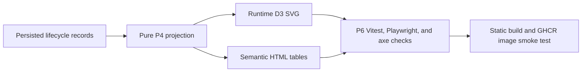

# Application Lifecycle Diagram P6 validation

**Status:** P6 implementation and validation record. The Diagram remains browser-only, IndexedDB-backed, and rendered as runtime SVG plus semantic HTML tables.

## Scope and completion

P6 hardens the P1-P5 Application Lifecycle Diagram for production readiness: bounded aggregate rendering, semantic parity, pagination, accessibility, responsive/touch behavior, hostile-string safety, large-data guardrails, static-build smoke coverage, container smoke validation, CI coverage, and text-only release documentation.

## Requirements-to-tests traceability

| P1/P6 requirement                                                                                | Validation coverage                                                                                                                  |
| ------------------------------------------------------------------------------------------------ | ------------------------------------------------------------------------------------------------------------------------------------ |
| Diagram tab appears immediately after Dashboard and opens at Current                             | `test/playwright/lifecycle-diagram.spec.js`; `test/playwright/browser-tracker.spec.js`                                               |
| IndexedDB remains the only application-data store                                                | Read-only IndexedDB snapshots in `test/playwright/lifecycle-diagram.spec.js`; static smoke server has no writable backend dependency |
| Runtime local `d3-sankey` SVG with no CDN                                                        | `test/playwright/static-smoke.spec.js`; build inspection for `/assets/tracker.js`                                                    |
| Equivalent semantic tables for origins, milestones, endpoints, flows, and events                 | `test/web-tracker-lifecycle-diagram.test.js`; `test/playwright/lifecycle-diagram.spec.js`                                            |
| Fixed taxonomy; no app/company SVG nodes                                                         | `test/web-tracker-lifecycle-diagram-performance.test.js` asserts at most 21 aggregate nodes and no per-application nodes             |
| Historical timeline, unknown-date, date-only, exact-time, inclusive cutoff, simultaneous buckets | P4 unit tests plus `test/playwright/lifecycle-diagram.spec.js` seeded journey                                                        |
| Selection not color-only and table buttons expose state                                          | `aria-pressed` and detail text assertions in Vitest and Playwright                                                                   |
| Keyboard-accessible semantic controls                                                            | Semantic table button tests in Vitest and Playwright                                                                                 |
| Pointer/touch SVG selection                                                                      | SVG node/link click and mobile tap coverage in Playwright; transparent hit-region tests in Vitest                                    |
| Bounded DOM and complete reachability                                                            | 50-row event/application pagination in Vitest performance coverage                                                                   |
| Accessibility                                                                                    | axe-core injected from local dependency in `test/playwright/lifecycle-diagram.spec.js`                                               |
| Reduced motion                                                                                   | CSS media query and Vitest reduced-motion rendering assertion                                                                        |
| Security/privacy                                                                                 | Hostile strings remain inert; no unsafe SVG/script/foreignObject; no mutating or cross-origin requests in Playwright                 |
| Static build/container readiness                                                                 | `test/playwright/static-smoke.spec.js`, `npm run build`, Docker build, and `npm run smoke:container -- jobbot3000:p6`                |

## Desktop and mobile coverage

Functional assertions run at the default desktop browser size and at a touch mobile viewport of `375×812`. The dedicated visual-review workflow captures human-review artifacts at `1440×900` and `375×812` in runner temp storage only.

## Accessibility checks

The focused Playwright spec injects the installed `axe-core` source locally and requires zero violations for empty, seeded current, historical/selected, and mobile states. Direct assertions cover named navigation, current state, SVG `role="img"` with `<title>`/`<desc>`, named range and scroll region, captions and scoped headers, polite live updates, visible focus, non-color-only selection text, 44×44 controls, and reduced-motion behavior.

## Security and privacy checks

The fixture and tests use synthetic data only. Hostile strings containing script, SVG markup, event-handler attributes, quotes, and `javascript:`-style content are asserted to remain inert text. Diagram interactions are read-only: no POST, PUT, PATCH, or DELETE request is produced, no cross-origin runtime request is allowed, no application data is placed in URLs/cookies/telemetry, and `d3-sankey` is loaded only through the local bundle.

## Large-data and DOM-clutter limits

`test/web-tracker-lifecycle-diagram-performance.test.js` creates 1,000 synthetic applications with eight effective lifecycle events each. After one warm-up render, the measured render must complete within 5,000 ms. The test asserts at most 21 aggregate SVG nodes, no per-application/company nodes, at most 50 rendered event rows, at most 50 rendered affected application IDs, complete pagination reachability, no projection mutation, and no `NaN`/`Infinity` SVG geometry.

## Static build and container checks

Static smoke coverage opens `/tracker`, imports deterministic lifecycle data, renders the Diagram SVG and tables, scrubs history, selects a feature, and observes no external runtime request. `/`, `/tracker`, `/healthz`, and `/livez` remain covered. `.github/workflows/ci-image.yml` remains the authoritative GHCR pull-request image build and smoke test.

## Verification commands and results

The PR handoff records exact command outcomes. Required commands are:

| Command                                                                                                                                                                               | Result                                                                                  |
| ------------------------------------------------------------------------------------------------------------------------------------------------------------------------------------- | --------------------------------------------------------------------------------------- |
| `npm ci`                                                                                                                                                                              | Pass locally                                                                            |
| `npm run format:check`                                                                                                                                                                | Fails locally due to pre-existing repository-wide Prettier drift outside P6 touch scope |
| `npm run lint`                                                                                                                                                                        | Pass locally                                                                            |
| `npm run typecheck`                                                                                                                                                                   | Pass locally                                                                            |
| `npx vitest run test/web-tracker-lifecycle-projection.test.js test/web-tracker-lifecycle-diagram.test.js test/web-tracker-lifecycle-diagram-performance.test.js`                      | Pass locally                                                                            |
| `npm run prepare:test`                                                                                                                                                                | Pass locally                                                                            |
| `PLAYWRIGHT_BROWSERS_PATH=.cache/ms-playwright PLAYWRIGHT_SKIP_BROWSER_DOWNLOAD=1 npx playwright test test/playwright/lifecycle-diagram.spec.js test/playwright/static-smoke.spec.js` | Pass locally                                                                            |
| `npm run test:ci`                                                                                                                                                                     | Pass locally                                                                            |
| `npm run build`                                                                                                                                                                       | Pass locally                                                                            |
| `git diff --check`                                                                                                                                                                    | Pass locally                                                                            |
| `BASE=$(git merge-base origin/main HEAD)`                                                                                                                                             | Not runnable in this container because no `origin` remote is configured                 |
| Secret scan and binary audit commands                                                                                                                                                 | Pass locally using PR base SHA `a8749262ef00a2b058b2b138eebcffc4219fb46e`               |
| Docker build and `npm run smoke:container -- jobbot3000:p6`                                                                                                                           | Not run locally because `docker` is unavailable; GHCR workflow remains authoritative    |

Follow-up verification on July 13, 2026 reconfirmed the restored sparse P4 projection contract and P6 UI coverage without changing P2-P4 semantics:

- `src/web/tracker/lifecycleProjection.js` keeps `countBy(paths, key, order = [])` sparse, so zero-count taxonomy categories are not inserted into projection totals for non-UI consumers.
- `test/web-tracker-lifecycle-diagram.test.js` verifies complete Diagram taxonomy rows against `LIFECYCLE_DIAGRAM_TAXONOMY` and separately asserts a rendered zero-count origin row, keeping UI completeness separate from sparse projection totals.
- `npm run format:check` still fails only because of repository-wide baseline Prettier drift outside the P6 touch set; no unrelated formatting rewrite is included in this PR.
- The GitHub-hosted Diagram visual-review workflow remains the required source of final artifact evidence: the expected artifact is `diagram-visual-review-${PR_NUMBER}-${RUN_ATTEMPT}` with `diagram-desktop-current.png`, `diagram-desktop-history.png`, `diagram-mobile-current.png`, and `diagram-mobile-history.png`.
- Follow-up UI hardening keeps the Diagram aggregate-first: semantic lifecycle data tables now live inside a closed-by-default `Lifecycle data tables` disclosure, affected application IDs live inside a closed-by-default bounded disclosure, and keyboard activation of semantic controls preserves focus while updating exactly one selected state.
- Historical `Newer activity available` now compares a stable timeline fingerprint captured when the user leaves Current, so selecting an older pre-existing bucket does not imply fresh data; returning to Current or losing the selected bucket clears the baseline.
- Real touch-mobile validation now uses a dedicated 375×812 `hasTouch` context with `deviceScaleFactor: 1`, verifies no page-level horizontal overflow, keeps chart/table overflow local, and exercises SVG node/flow selection through touchscreen taps.
- The visual-review capture script now fixes `deviceScaleFactor: 1`, asserts viewport width and no page-level overflow before each capture, and validates PNG IHDR widths as 1440px for desktop and 375px for mobile.
- Playwright coverage now records separate literal expectations for raw fixture P4 endpoint totals (`Awaiting response: 2`, `Unknown: 1`) and supported imported/reconciled UI totals (`Awaiting response: 3`, `Unknown: 0`), because the browser import path reconciles the deliberately incomplete hostile application into its current awaiting-response endpoint without changing P4 projection semantics.
- The focused lifecycle Playwright journey asserts hard-coded imported origin, milestone, endpoint, and representative-flow counts; SVG label parity; exact/date-only/unknown time display; historical tab-navigation persistence; real touch selection parity; and bounded read-only Diagram behavior.

## Binary-file policy

No PNG, APNG, JPEG, GIF, WebP, AVIF, BMP, ICO, TIFF, PDF, video, archive, font binary, Playwright golden image, screenshot fixture, or other binary source artifact may be created, modified, staged, or committed for P6. Mermaid remains source text only. Visual-review PNGs are generated only by `.github/workflows/diagram-visual-review.yml` under `${RUNNER_TEMP}/jobbot3000-diagram-visual-review` and uploaded as short-retention GitHub Actions artifacts.

## Data-flow validation diagram

| Relationship                                                                    | Text equivalent                                                                                                    |
| ------------------------------------------------------------------------------- | ------------------------------------------------------------------------------------------------------------------ |
| Persisted lifecycle records → Pure P4 projection                                | IndexedDB v2 application and lifecycle-event records feed the deterministic projection engine.                     |
| Pure P4 projection → Runtime D3 SVG                                             | The projection is cloned before D3 layout so the frozen P4 output is not mutated.                                  |
| Pure P4 projection → Semantic HTML tables                                       | The same origin, milestone, endpoint, flow, and event data is rendered in tables.                                  |
| Runtime D3 SVG and Semantic HTML tables → P6 Vitest, Playwright, and axe checks | Tests verify SVG geometry, semantic parity, accessibility, selection, pagination, responsive behavior, and safety. |
| P6 checks → Static build and GHCR image smoke test                              | Passing focused checks feed static distribution validation and the container image smoke workflow.                 |
