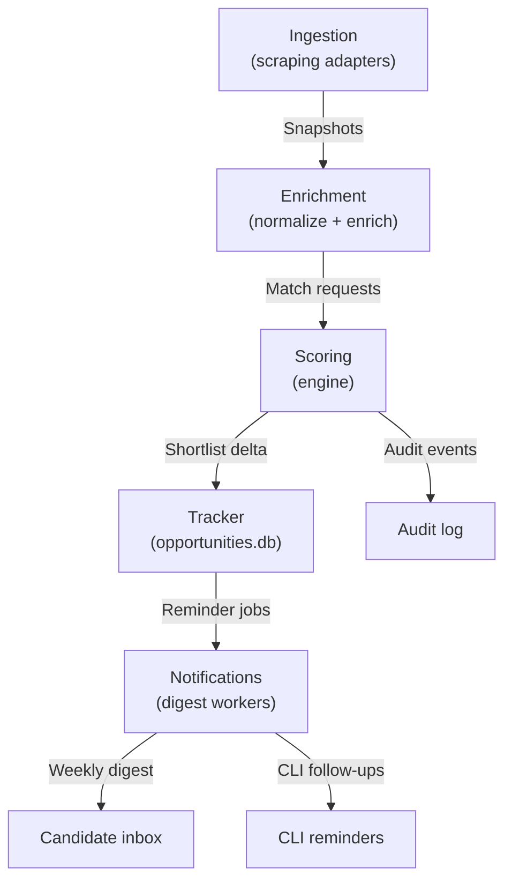

# User Journeys

This document enumerates the end-to-end user journeys that jobbot3000 needs to support. Each
journey captures the primary goal, key actors, happy path, and notable unhappy paths so we can
translate them into backlog items, prompts, and acceptance tests.

## Journey 1: Import and Normalize a Resume

**Goal:** A candidate imports an existing resume and turns it into the canonical profile used across
jobbot3000.

### CLI flow

1. Run `jobbot init` (or the explicit `jobbot profile init`) to scaffold an empty
   `data/profile/resume.json` structure when no canonical profile exists.
2. Import source material:
   - `jobbot import file <path>` for PDFs, DOCX, Markdown, or plain text resumes.
   - `jobbot import linkedin <zip>` to merge LinkedIn exports without overwriting confirmed fields.
   - `jobbot import json <resume.json>` when migrating from another JSON Resume implementation.
3. Invoke `jobbot profile inspect --with-metrics` to extract clean text, metadata, and parsing
   confidence so the candidate can review detected format, word counts, and missing sections before
   normalization.
4. Confirm or edit the parsed sections via `jobbot profile edit <section>` or re-run `jobbot import`
   with `--merge-strategy replace|merge` to control overwrites.
5. Persist the normalized profile to `data/profile/` and version subsequent edits with
   `jobbot profile snapshot --note <message>`. The command writes structured JSON snapshots under
   `data/profile/snapshots/` that include the ISO timestamp, optional note, and a copy of the
   current `resume.json`, letting downstream tailoring reference specific revisions. Regression
   coverage in [`test/cli.test.js`](../test/cli.test.js) exercises the happy path, JSON output, and
   missing-resume failure case.

### Web flow

1. Visit **Profile ▸ Import** and upload a source file or paste raw text; the UI mirrors the CLI
   loaders and calls the shared `loadResume` helper with `withMetadata: true`.
2. Review the parsed preview pane that highlights detected sections, ATS warnings, and ambiguity
   callouts (e.g., missing years). Inline pills offer quick fixes ("Mark as contract", "Convert to
   YYYY") that dispatch the same normalization mutations used by the CLI.
3. Accept or reject suggestions in the **Normalization** step; edits update the local
   `resume.json` copy immediately and surface diff previews so the user can confirm changes before
   saving.
4. Save to the local workspace; the UI confirms the destination path under `data/profile/` and
   surfaces a link to open the file in the preferred editor.
5. Optionally trigger **Create Snapshot** from the toolbar, which mirrors `jobbot profile snapshot`
   and stores timestamped revisions under `data/profile/snapshots/` for later auditing.

### Unhappy paths & recovery

- Unsupported files, encrypted PDFs, or malformed LinkedIn exports surface actionable error dialogs
  with remediation steps (convert to PDF, export uncompressed JSON, remove password). The CLI emits
  structured JSON errors with machine-readable codes (`UNSUPPORTED_FORMAT`, `PDF_ENCRYPTED`).
- Partial parses flag missing sections and suggest manual entry via `jobbot profile edit` or the web
  form. Both surfaces track unresolved items so tests can assert that the user is blocked until
  they acknowledge the warnings.

### Edge cases

- Resumes longer than 10 pages warn about ATS compatibility but still import; tests ensure the
  warning does not block the happy path.
- Duplicate work history entries trigger dedupe prompts that rely on job title + time range hashes;
  the flow must confirm merges before removing the duplicate.
- Binary formats (`.pages`, `.odt`) fall back to an external converter; the CLI prompts the user to
  install the helper, while the web flow queues a background conversion and emails progress when
  enabled.

### Failure modes & alerts

- Disk-write failures (e.g., read-only directories) produce explicit alerts and keep the in-memory
  profile so the user can retry after fixing permissions.
- Resume loader crashes emit telemetry events tagged `resume-import` so QA can trace regressions.
- Validation mismatches between CLI and web responses surface as contract test failures where shared
  fixtures assert identical normalized JSON payloads.

## Journey 2: Clarify the Candidate Profile

**Goal:** Capture the intent, context, and nuance that a static resume omits.

### CLI flow

1. Generate the question backlog with `jobbot intake plan --profile data/profile/resume.json`.
   Optionally add `--json` to feed automated review tools.
2. Iterate through prompts using `jobbot intake record --question <id>`; the command accepts
   `--answer`, `--tags`, and `--confidence` so the assistant can track certainty.
3. Use `jobbot intake record --skip <id> --reason <text>` when the candidate defers a question.
   Skipped entries are automatically re-queued for later sessions.
4. Summarize collected insights with `jobbot intake bullets --tag strengths --json` and merge them
   into the profile via `jobbot profile merge intake` once the candidate confirms accuracy.
5. Export the session transcript with `jobbot intake export --out data/profile/intake-<date>.json`
   for regression testing and audit trails. Pass `--redact` to mask compensation, visa, and other
   sensitive answers in the exported JSON. This lets teammates review structure without seeing
   private values.

### Web flow

1. Navigate to **Profile ▸ Intake**; the UI fetches the same plan API and displays prioritized
   prompts with confidence badges and topic filters.
2. Answer questions in a chat-style interface that mirrors CLI field validation. Inline controls
   allow attaching tags, marking confidences, or postponing with structured reasons.
3. Review and accept the synthesized bullet suggestions; the UI highlights their provenance (resume
   section, intake question) and allows direct edits before committing.
4. Publish to the profile. Saving writes to `data/profile/intake.json` and triggers background
   consistency checks that ensure the intake data references valid resume sections.
5. Export transcripts via the **Download JSON** button, which reuses the CLI export serializer so
   automated tests can diff outputs across surfaces.

### Unhappy paths & recovery

- Users can abandon sessions mid-question; the system stores a draft state so CLI `jobbot intake
resume` or the web **Resume Session** button can continue where they left off.
- When the LLM refuses or fails to produce a plan, the flows expose a manual question builder with
  templates. QA scenarios confirm that skipping LLM generation still allows successful completion.

### Edge cases

- Conflicting answers (e.g., contradictory location preferences) trigger conflict resolution prompts
  requiring the user to pick a canonical value before continuing.
- Sensitive questions (compensation, visa) respect redaction flags; the UI and CLI both mask stored
  values when `--redact` is active so tests can confirm privacy compliance. CLI listings and exports
  replace answers/notes with `[redacted]` while preserving metadata for downstream automation.

### Failure modes & alerts

- Intake writes failing because of schema drift emit contract test failures that compare against the
  JSON Schema stored under `schema/intake.schema.json`.
- Network outages in the web flow fall back to offline mode with local persistence and retry queues;
  CLI captures similar failures and suggests `--offline` to skip LLM calls.

## Journey 3: Source and Stage Job Postings

**Goal:** Build a living shortlist of job opportunities pulled from the web or supplied manually.

### CLI flow

1. Fetch postings via adapters, e.g., `jobbot ingest greenhouse --company acme`,
   `jobbot ingest lever --company acme`, or `jobbot ingest url <job-url>` for single listings.
2. Normalize and store postings automatically under `data/jobs/{job_id}.json` with raw + parsed
   payloads and metadata.
3. Curate the shortlist:
   - `jobbot shortlist tag <job_id> --tags dream,referral` to annotate promising roles.
   - `jobbot shortlist discard <job_id> --reason duplicate --tags stale` to archive unfit roles.
   - `jobbot shortlist sync <job_id> --location remote --compensation 220000` to refresh metadata.
4. Filter the active list with `jobbot shortlist list --location remote --tag referral --json` and
   export curated outputs via `--out data/exports/shortlist.json`.
5. Automate recurring pulls using `jobbot schedule run --config configs/shortlist.yml --cycles 3` to
   confirm the scheduler respects rate limits and updates the shortlist without manual intervention.

### Web flow

1. Open the **Listings** tab and accept the default **All providers** option. The identifier input is
   hidden in this mode so users only tweak lightweight filters like the job title (e.g., "Software
   Engineer") before pressing **Fetch listings**. The UI aggregates results from configured boards,
   paginates them 10 at a time, and exposes metadata such as compensation, snippets, and remote
   flags. Pressing **Ingest listing** persists the normalized posting under `data/jobs/`, wires it
   into shortlist analytics, and keeps it available for downstream automations until explicitly
   archived.
2. Use **Jobs ▸ Import** to select a source adapter, authenticate if required, and enter the company
   slug or job URL. The web flow streams progress updates while the shared ingestion pipeline runs.
3. Review imported postings in the **Jobs Inbox** with side-by-side raw HTML and normalized summaries.
4. Tag or discard roles via inline controls; discards prompt for reason + tags, mirroring the CLI.
5. Switch to the **Shortlist** tab to filter by location, level, compensation, and tags. A bulk
   action bar supports exporting the current view as JSON or CSV.
6. Configure **Automations** to schedule nightly imports. The UI surfaces adapter health, retry
   counts, and last-success timestamps so QA can validate monitoring hooks.

### Unhappy paths & recovery

- Rate-limit or ToS denials surface a retry-after suggestion; the CLI prints the header value, and
  the web flow shows a countdown before re-enabling the import button.
- Missing authentication secrets halt the run with instructions for configuring `.env.local` or the
  CLI keychain.
- Duplicate postings are automatically deduped; users can override by enabling **Keep duplicates** in
  settings. Tests must cover both deduped and override scenarios.

### Edge cases

- Incomplete job descriptions (no responsibilities/requirements) flag `INCOMPLETE_POSTING`; the UI
  prompts for manual edits before allowing tailoring.
- Locale-specific compensation (€, £) renders using the source currency; CLI exports include both raw
  values and USD conversions when the exchange rate service is available.
- Offline mode caches fetch requests and replays them once connectivity returns, ensuring the shortlist
  remains consistent between CLI and UI sessions.

### Failure modes & alerts

- Adapter crashes emit structured logs with `adapter`, `job_id`, and `request_id`; integration tests
  assert that failures do not corrupt existing shortlist files.
- Scheduler misconfigurations (missing config file, invalid cron) trigger validation errors before
  execution and log to `logs/scheduler.log` for postmortems.
- Web socket disconnects while streaming ingestion fall back to polling; QA should verify the UI
  resumes updates without duplicating entries.

## Journey 4: Match, Tailor, and Generate Deliverables

**Goal:** Produce truthful, role-specific collateral that maximizes the candidate's odds.

### CLI flow

1. Score a job with `jobbot match <job_id> --explain --json` to capture fit metrics, evidence
   snippets, and blocker rationale in a machine-readable format.
2. Tailor deliverables using `jobbot tailor <job_id> --profile data/profile/resume.json --out
data/deliverables/<job_id>/` which generates resume variants, cover letters, and match reports.
3. Inspect generated diffs via
   `jobbot deliverables diff <job_id> --timestamp latest --json` when you want machine-readable
   output, or omit `--json` for a human summary that highlights added, removed, and changed resume
   fields before sharing artifacts.
4. Apply manual edits with `jobbot deliverables edit <job_id> --file resume.md` and re-run
   `jobbot tailor` with `--regenerate` to blend manual tweaks with AI suggestions.
5. Package artifacts for sharing via `jobbot deliverables bundle <job_id> --timestamp latest --out
share/<job_id>.zip`.

### Web flow

1. Select a job from the **Shortlist** and open the **Match** tab. The UI invokes the same matcher
   API and displays fit scores, evidence, blockers, and recommendations.
2. Click **Generate Deliverables** to run the tailoring pipeline. Progress indicators show each
   artifact step (resume, cover letter, diff) as the shared worker completes them.
3. Review the generated resume, cover letter, and match summary inline; the UI highlights modified
   bullet points and allows in-place edits with undo history.
4. Approve the bundle to finalize; the system stores artifacts under `data/deliverables/` and shows
   download buttons for PDF, TXT, and JSON outputs.
5. Share via the **Export Bundle** button which mirrors the CLI bundle command and logs the
   download event for analytics.

### Unhappy paths & recovery

- Low fit scores (<50) prompt remediation suggestions (skill prep, alternative roles) and offer a
  "Skip tailoring" action that records the decision without generating artifacts.
- Missing mandatory resume sections (e.g., no work history) block tailoring and surface a link back
  to the profile editor.
- Generation timeouts allow retrying the failed step; the worker resumes from the last successful
  artifact to avoid duplicate work.

### Edge cases

- Jobs requiring multiple resume variants (e.g., region-specific) allow selecting templates; QA must
  validate that template overrides propagate to CLI (`--template <name>`) and UI.
- Tailoring with alternative profiles ensures `--profile` handles relative and absolute paths,
  matching the web **Switch Profile** menu.
- Generating deliverables for jobs with redacted sections ensures sensitive data stays masked in
  logs and outputs.

### Failure modes & alerts

- Renderer crashes log to `logs/deliverables.log` and surface toast alerts in the UI with trace IDs.
- Storage quota issues (disk full) halt generation and keep partial outputs in a quarantined folder
  until space is freed.
- Contract tests verify CLI and UI outputs are byte-identical for the same inputs, preventing drift.

## Journey 5: Apply and Track Outcomes

**Goal:** Keep a comprehensive record of every interaction with employers.

### CLI flow

1. Log outreach with `jobbot track log <job_id> --channel email --note "Sent resume" --remind-at
2024-05-01T09:00:00Z` which stores the event in `data/application_events.json`.
2. Update status transitions via `jobbot track add <job_id> --status screening --note "Recruiter
call scheduled"`.
3. Review the pipeline with `jobbot track board --json` to confirm jobs group correctly by stage and
   surface reminders.
4. Inspect job history via `jobbot track history <job_id>` for audit trails.
5. Export reminders to calendar format through `jobbot track reminders --ics exports/followups.ics`
   and verify the file omits past-due entries.

### Web flow

1. Visit **Pipeline** and use **Log Event** to add outreach notes, attach documents, and schedule
   reminders; the UI writes to the same local JSON files through shared APIs.
2. Drag-and-drop jobs between columns to update status; the system records transitions and prompts
   for optional notes.
3. Review reminders in the **Follow-ups** sidebar, which mirrors the CLI digest (Past Due vs
   Upcoming) and supports snooze/done actions backed by `jobbot track reminders snooze <job_id>
--until <iso>` and `jobbot track reminders done <job_id> [--at <iso>]`.
4. Export ICS files via the **Calendar Sync** button (backed by `POST /commands/track-reminders`) and
   confirm downloads contain sanitized data. `test/web-server.test.js` verifies the button dispatches
   the `jobbot:reminders-exported` event and streams a calendar download without leaking details.
5. Open a job detail drawer to view the full history, add comments, or share updates with mentors.

### Unhappy paths & recovery

- Merge conflicts from multi-device edits trigger a reconciliation wizard that shows both versions
  and lets users pick the correct note/status. The wizard writes a JSON resolution plan that
  `jobbot track resolve --plan <file>` applies, keeping selected notes intact or clearing them when
  entries set `"note": null` (equivalent to passing `--clear-note`).
- Invalid status transitions (e.g., moving from `rejected` back to `onsite`) require confirmation and
  log an audit entry.

### Edge cases

- Logging outreach without a job ID creates a `miscellaneous` bucket; flows must prompt the user to
  assign the event later.
- Timezone differences when setting reminders ensure ICS exports use UTC while the UI displays local
  time.
- Attachments larger than 10 MB warn the user and suggest linking to cloud storage instead.

### Failure modes & alerts

- File-write errors emit toasts and CLI errors referencing the failing path; the system queues the
  event in memory until the issue is resolved.
- Calendar export failures (malformed events) log to `logs/calendar.log` and surface a **Report bug**
  button that downloads a JSON bundle referencing the log entry ID for maintainers.
- Automated tests assert that CLI and web exports stay in sync by comparing ICS fixtures.

## Journey 6: Prepare for Interviews

**Goal:** Simulate the target interview loop and address skill gaps ahead of time.

### CLI flow

1. Generate an interview plan using `jobbot interviews plan --job <job_id> --stage behavioral` to
   create targeted prompts, resources, and checklists.
2. Rehearse with `jobbot rehearse <job_id> --stage behavioral --audio recordings/mock.mp3` to
   transcribe practice answers via configured STT providers.
3. Record session notes using `jobbot interviews record <job_id> --session <id> --notes <text>
--rating 4`.
4. Review progress with `jobbot interviews show <job_id> --session <id> --json` to inspect metrics
   like words per minute and STAR coverage.
5. Export sessions via
   `jobbot interviews export --job <job_id> --out exports/interviews-<job_id>.zip` for coaching
   feedback loops; the archive stores session JSON plus a manifest listing stage, mode, and
   recorded timestamps.

### Web flow

1. Open **Interviews ▸ Planner** and select the job + stage; the UI renders the same plan with
   collapsible sections for resources, flashcards, and dialog trees.
2. Start a rehearsal session with optional voice capture; the browser records audio locally and uses
   configured STT workers to generate transcripts.
3. Annotate feedback inline, add ratings, and tag competencies that need work.
4. View session analytics (pace, filler words, STAR completeness) in charts that mirror CLI metrics.
5. Export sessions or share with mentors directly from the UI, triggering the same zip bundle.

### Unhappy paths & recovery

- Missed sessions trigger gentle nudges via notification center and CLI `jobbot interviews remind`,
  which surfaces jobs with no recorded rehearsals or stale sessions beyond the configurable
  `--stale-after` window (`test/interviews.test.js` and `test/cli.test.js` lock the reminder digest
  and JSON output in place).
- Audio transcription failures prompt manual upload of text notes; flows ensure the session can still
  be completed without voice data.

### Edge cases

- Multi-stage loops (e.g., systems design + behavioral same day) allow chaining plans; tests confirm
  aggregated schedules respect chronological order.
- Sessions recorded without timestamps still compute STAR coverage using text heuristics.
- External mentors accessing shared exports respect redaction rules for confidential company names.

### Failure modes & alerts

- STT/TTS command failures bubble up with actionable error messages and fallback instructions to use
  text-only mode.
- Browser permission denials for microphone access trigger inline troubleshooting guidance and a CLI
  tip (`jobbot rehearse --audio <path>`).
- Data corruption (invalid JSON) surfaces via integrity checks before saving; the system writes to a
  temp file and only swaps in the new session once validation passes.

## Journey 7: Measure Outcomes and Close the Loop

**Goal:** Maintain visibility into success rates and continuously improve recommendations.

### CLI flow

> [!NOTE] > **Update (2025-10-13):** `jobbot analytics activity` now ships via the CLI, wiring
> `computeActivitySummary` to the analytics surface with guardrails that require
> `--out` values when provided. [`test/cli.test.js`](../test/cli.test.js)
> exercises both the sanitized export and the usage error when `--out` lacks a
> path so the workflow stays reliable.

1. Run `jobbot analytics funnel --json` to compute conversion metrics and generate Sankey-ready
   structures.
2. Refresh recommender signals with `jobbot analytics activity --out data/analytics/activity.json`
   summarizing deliverable runs and interview sessions. Regression coverage in
   [`test/cli.test.js`](../test/cli.test.js) enforces the sanitized activity export so the CLI writes
   aggregate counts without leaking job identifiers.
3. Inspect gaps using `jobbot analytics health` which highlights missing data, schema drift, or stale
   snapshots.
   Regression coverage in [`test/analytics.test.js`](../test/analytics.test.js) and
   [`test/cli.test.js`](../test/cli.test.js) keeps the missing-status, schema-drift, and
   stale-outreach warnings aligned with the CLI output.
4. Schedule periodic exports via `jobbot schedule run --config configs/analytics.yml` to ensure
   analytics stay current.
5. Share sanitized aggregates through `jobbot analytics export --out share/analytics.csv`.
   Include `--redact` when you need to anonymize company names in the exported `companies` summary
   before circulating metrics outside the immediate team.

### Web flow

1. Navigate to **Analytics** to view funnel charts, activity dashboards, and health warnings derived
   from the same API endpoints.
2. Filter by timeframe, role type, or company. Filters map to CLI flags (`--from`, `--to`,
   `--company`) so automated tests can reuse fixtures. Regression coverage in
   [`test/analytics.test.js`](../test/analytics.test.js) and
   [`test/cli.test.js`](../test/cli.test.js) locks the date/company filters so both CLI
   and UI views stay aligned.
3. Drill into anomalies via the **Health** tab which lists missing statuses or outdated deliverables
   and links back to the relevant workflows.
4. Export dashboards as CSV/JSON via the **Download** buttons, which call the
   shared `/commands/analytics-export` service before streaming blobs to the
   browser. [`test/web-server.test.js`](../test/web-server.test.js) verifies the
   DOM workflow, emitted `jobbot:analytics-exported` events, and sanitized
   filenames, while [`test/web-command-adapter.test.js`](../test/web-command-adapter.test.js)
   ensures the adapter forwards the CLI payload without leaking secrets.
5. Subscribe to weekly summary emails via **Notifications**. Run
   `jobbot notifications subscribe --email you@example.com` (optionally tuning
   `--lookback-days`) to add yourself to the digest roster, then schedule
   `jobbot notifications run` via the existing task scheduler so the CLI writes
   each summary to `notifications/outbox/` for delivery.

### Unhappy paths & recovery

- When analytics detects missing status updates, both CLI and UI display actionable tasks to backfill
  data before recomputing metrics.
- Failed exports due to locked files queue retries and prompt the user to close external editors.

### Edge cases

- Sparse data (e.g., only one job logged) still renders funnel charts with placeholder nodes; QA
  ensures percentages do not divide by zero.
- Backdated entries (applications logged retroactively) update historical aggregates correctly.
- Privacy mode redacts company names when exporting; CLI `--redact` flag and web **Redact company**
  toggle must produce identical results. [`test/web-server.test.js`](../test/web-server.test.js)
  exercises redacted and unredacted downloads so both paths stay aligned.

## Journey 8: Capture Recruiter Outreach and Drive the Interview Loop

**Goal:** Make cold recruiter emails durable, actionable records that feed interview prep.

### CLI flow

1. Save the recruiter email as plaintext and ingest it with
   `node bin/ingest-recruiter.ts --source emails/instabase.txt`. The CLI persists contacts,
   attachments, and lifecycle events in `data/opportunities.db`.
2. Run `jobbot analytics sankey --json` (or use the new Sankey UI) to confirm the
   `recruiter_outreach → phone_screen_scheduled` edge appears alongside other stages.
   > [!NOTE] > **Update (2025-10-22):** `jobbot analytics sankey --json` now ships from the CLI,
   > returning opportunity edges for recruiter outreach through phone screens.
   > When the SQLite module is unavailable the CLI reads
   > `data/opportunities/events.ndjson`, keeping analytics functional in
   > constrained environments. [`test/cli.test.js`](../test/cli.test.js) exercises the
   > JSON output so the Sankey transitions stay aligned with the UI summary.
3. Trigger reminders with `jobbot reminders schedule --opportunity <uid>` so follow-ups and prep
   checklists fire relative to the scheduled phone screen. The CLI now writes the documented trio of
   reminders—prep 24 hours before, logistics 1 hour before, and a thank-you follow-up 2 hours
   after—and keeps the schedule idempotent when rerun or when the phone screen time shifts.
   [`test/cli.test.js`](../test/cli.test.js) locks down the happy path, duplicate guardrails, and the
   reschedule flow so reminders stay accurate.
4. Export the durable record via `node scripts/export-data.ts > backups/opportunities.ndjson` to
   sync across devices.

### Web flow

1. From **Opportunities ▸ New → Recruiter outreach**, paste the email body. The modal previews the
   parsed contact, subject, and proposed times before saving. Regression coverage in
   [`test/web-server.test.js`](../test/web-server.test.js) keeps the preview aligned with the CLI by
   asserting the company, subject, contact, and schedule rows render after a successful ingest.
2. The opportunity detail view surfaces the phone screen schedule (`Phone screen: Thu Oct 23, 2:00 PM PT`)
   with quick actions to confirm availability or adjust reminders.
3. Use **Prep ▸ Interviews** to launch the automatically generated prep plan seeded from the outreach
   metadata (company, role hint, recruiter notes).
4. Advance the lifecycle to **Phone screen done** once the conversation finishes; the UI appends the
   corresponding audit entry and refreshes the Sankey to show the updated edge weight.

### Resilience & recovery

- Duplicate ingests are idempotent; hashes keep recruiter outreach from creating duplicate records.
- Missing or malformed timestamps fall back to the email header `Date:` value while logging a warning
  in the audit trail.
- Export/import flows validate schemas (via Zod) before writing so corrupted backups never clobber
  production data.

### Failure modes & alerts

- Schema version mismatches trigger migrations before analytics runs; failures halt processing and
  surface a remediation script.
- Visualization rendering failures in the UI fall back to tabular views; CLI prints plain-text
  tables when the chart generator crashes.
- Scheduler outages notify maintainers via local notifications and mark dashboards with a warning
  banner until resolved.

## Journey 5: Background ingestion to notifications

**Goal:** Automate the end-to-end flow from job ingestion through scoring and notification delivery
while preserving privacy guardrails.

1. The scheduler emits `scraping:jobs:fetch` events via the module event bus.
   Scraping adapters respect rate limits and provider feature flags before persisting redacted
   snapshots. Regression coverage
   in [`test/schedule-config.test.js`](../test/schedule-config.test.js) asserts scheduled ingestion
   tasks dispatch through the bus so overrides, mocks, and logging stay aligned.
2. Enrichment stages rebuild resume contexts, emit match requests, and forward normalized payloads to
   the scoring engine. The diagram mirrors the shared pipeline in
   [`src/pipeline/resume-pipeline.js`](../src/pipeline/resume-pipeline.js).
3. Scoring updates shortlist metadata, tags blockers, and records structured audit entries for admins
   while emitting downstream tracker updates for lifecycle history.
4. Tracker updates power reminder jobs that the notifications worker consumes. The worker composes
   weekly digests, CLI reminders, and audit-safe exports depending on feature flags.

---

These journeys should stay aligned with the project's safety principles: keep everything local by
default, refuse to fabricate accomplishments, and provide clear audit trails for every generated
artifact. They can be decomposed into smaller tasks across the CLI, future UI, prompts, and storage
layers while keeping personal data sealed inside git-ignored directories.
